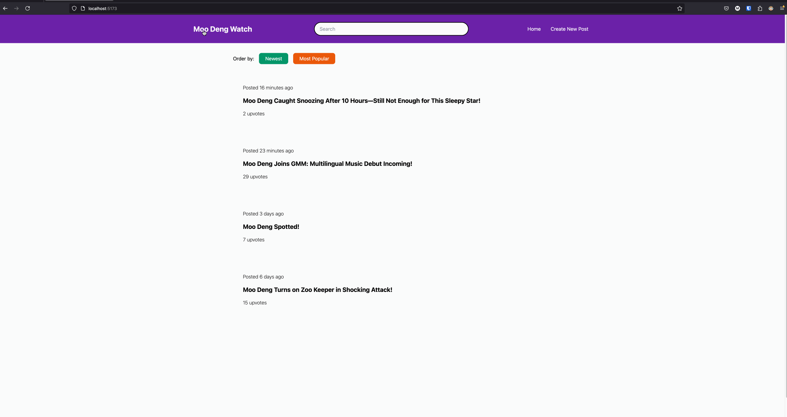

# Web Development Final Project - _HobbyHub_

Submitted by: **Christopher Mendez**

This web app: **a forum to talk about all things Moo Deng!**

Time spent: **15** hours spent in total

## Required Features

The following **required** functionality is completed:

- [x] **A create form that allows the user to create posts**
- [x] **Posts have a title and optionally additional textual content and/or an image added as an external image URL**
- [x] **A home feed displaying previously created posts**
- [x] **By default, the time created, title, and number of upvotes for each post is shown on the feed**
- [x] **Clicking on a post shall direct the user to a new page for the selected post**
- [x] **Users can sort posts by either their created time or upvotes count**
- [x] **Users can search for posts by title**
- [x] **A separate post page for each created post, where any additional information is shown is linked whenever a user clicks a post**
- [x] **Users can leave comments underneath a post on the post's separate page**
- [x] **Each post should have an upvote button on the post's page. Each click increases its upvotes count by one and users can upvote any number of times**
- [x] **A previously created post can be edited or deleted from its post page**
- [x] Display a loading animation whenever data is being fetched

## Video Walkthrough

Here's a walkthrough of implemented user stories:

GIF created with LICEcap

## Notes

- Utilized **React Hook Form** to build the create/edit post forms. RHF provides flexible and easy-to-use validation.
- Instead of reinventing the wheel, I used a JS library called **date-fns** to format post timestamps which required researching the library's docs on how to use it in a way that would work with my project.
- Used **Tanstack query** for fetching data and handling async state management with Supabase. Ran into issues with updating posts on the client and syncing them to the database, so I spent some time learning about useMutations.
- Researched the **useContext** hook to set up global state, allowing the search bar in the navbar the ability to filter posts effectively.
- In terms of improvements for next time, I would've like to spent some more time on the design and branding of the forum. Maybe add a little hippo mascot to the navbar logo & favicon. I would like to add a little hippo mouth opening animation when a user upvotes a post. Finally, not a big fan of the colors.

## License

    Copyright 2024 Christopher Mendez

    Licensed under the Apache License, Version 2.0 (the "License");
    you may not use this file except in compliance with the License.
    You may obtain a copy of the License at

        http://www.apache.org/licenses/LICENSE-2.0

    Unless required by applicable law or agreed to in writing, software
    distributed under the License is distributed on an "AS IS" BASIS,
    WITHOUT WARRANTIES OR CONDITIONS OF ANY KIND, either express or implied.
    See the License for the specific language governing permissions and
    limitations under the License.
